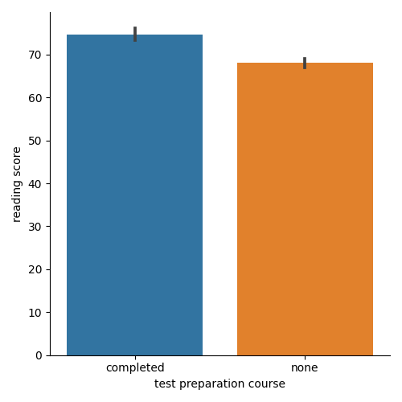
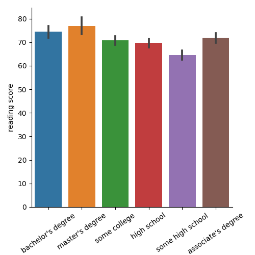

# Analyzing exam scores

Now let's now move on to the competition and challenge.

## 📖 Background
Your best friend is an administrator at a large school. The school makes every student take year-end math, reading, and writing exams.

Since you have recently learned data manipulation and visualization, you suggest helping your friend analyze the score results. The school's principal wants to know if test preparation courses are helpful. She also wants to explore the effect of parental education level on test scores. 

## 💾 The data

#### The file has the following fields ([source](http://roycekimmons.com/tools/generated_data/exams)):
- "gender" - male / female
- "race/ethnicity" - one of 5 combinations of race/ethnicity
- "parent_education_level" -  highest education level of either parent
- "lunch" - whether the student receives free/reduced or standard lunch
- "test_prep_course" - whether the student took the test preparation course
- "math" -  exam score in math 
- "reading" -  exam score in reading 
- "writing" -  exam score in writing 

## 💪 Challenge
Create a report to answer the principal's questions. Include:

1. What are the average reading scores for students with/without the test preparation course?
2. What are the average scores for the different parental education levels?
3. Create plots to visualize findings for questions 1 and 2.
4. [Optional] Look at the effects within subgroups. Compare the average scores for students with/without the test preparation course for different parental education levels (e.g., faceted plots).
5. [Optional 2] The principal wants to know if kids who perform well on one subject also score well on the others. Look at the correlations between scores. 
6. Summarize your findings.

# Prep course average scores:

Find the average reading scores for students with/without the test preparation course

We can use `groupby` to group the information by the column "test_prep_course", then we select the "reading" column
and we use `.mean()` to find the average.

# Parental education level average scores:

Find the average reading scores for students with/without the test preparation course

We can use `groupby` to group the information by the column "parent_education_level", then we select the "reading" column
and we use `.mean()` to find the average.

# Vizualizing data:

After calculating the average reading scores with/without test preparation course, and the parental education level, we can now create plots to vizualize the data we found and get better understanding of it.

#

#### the average reading scores for students with/without the test preparation course

#
#### the average reading scores for students with/without the test preparation course
